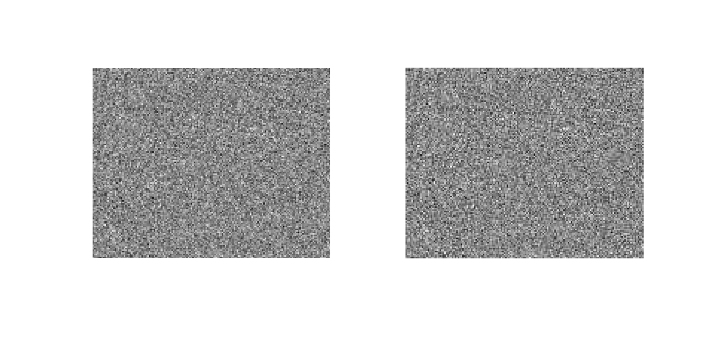

# 信号与系统——MATLAB综合实验之语音合成

无81 马啸阳 2018011054

## 基础知识

### 1. 使用`help images`阅读并大致了解图像处理工具箱中的函数基本功能

### 2. 完成基本图像处理：以测试图像中心为圆心，长和宽中较小值的一半为半径画一个红色的圆；将测试图像涂成国际象棋状的“黑白格”的样子

图像的基本I/O函数有`imread`、`imwrite`，我们使用`imwrite`将图像处理完的矩阵存入文件，`imshow`可以查看图片。

**(a) 画圆**

圆有两种含义，这里我们依次画空心圆与实心圆。以下代码中部分参数如`width`、`height`的定义略去，具体可参见完整代码。

首先定义半径和圆心：

```matlab
radius = min(width, height) / 2;
center = [width/2 + 0.5, height/2 + 0.5];
```

这里需要注意的是，matlab中的下标从1开始，故中心坐标应各补上1/2。

空心圆代码如下：

```matlab
theta = 0:359;
x = max(min(round(center(1) + radius * cos(theta)), width), 1);
y = max(min(round(center(2) + radius * sin(theta)), height), 1);
idx_R = sub2ind(size(hall_color), x, y, ones(1,360));
idx_G = sub2ind(size(hall_color), x, y, 2 * ones(1,360));
idx_B = sub2ind(size(hall_color), x, y, 3 * ones(1,360));
hall_color(idx_R) = 255;
hall_color(idx_G) = 0;
hall_color(idx_B) = 0;
imwrite(hall_color, 'results/hallCircle.png');
```

这里使用圆的参数方程，由$\theta$依次生成$x = x_0 + r \cos \theta$，$y = y_0 + r\sin \theta$，这里的`max`、`min`作用是将下标限制在图像范围内。然后使用`sub2ind`将坐标转换为`hall_color`数组中的坐标，通道全1代表RGB中的红色（`idx_R`），通道全2和全3对应RGB中的绿色和蓝色（`idx_G`和`idx_B`）。再将通道1的对应下标置255，通道2、3的对应下标置0，就将这些像素点置红了。结果如下：


实心圆代码如下：

```matlab
% generate coordinates meshgrid and get circle_mask
[xcord, ycord] = meshgrid(1:height, 1:width, 1:channel);
circle_mask = (xcord(:, :, 1) - center(2)) .^ 2 + (ycord(:, :, 1) - center(1)) .^ 2 < radius ^ 2;
mask_color = uint8([255, 0, 0]);
% copy each channel out and set masked points to mask_color
hall_R = hall_color_copy(:, :, 1);
hall_G = hall_color_copy(:, :, 2);
hall_B = hall_color_copy(:, :, 3);
hall_R = uint8(circle_mask) .* mask_color(1) + uint8(~circle_mask) .* hall_R;
hall_G = uint8(circle_mask) .* mask_color(2) + uint8(~circle_mask) .* hall_G;
hall_B = uint8(circle_mask) .* mask_color(3) + uint8(~circle_mask) .* hall_B;
% put each channel into hall_circle
hall_circle(:, :, 1) = hall_R;
hall_circle(:, :, 2) = hall_G;
hall_circle(:, :, 3) = hall_B;
imwrite(hall_circle, 'results/hallCircle2.png');
```

思路在于制作掩膜，将掩膜中的点置红。具体地，首先使用`meshgrid`产生网格坐标（图像中每个点的横纵坐标依次排列），然后利用圆方程产生`circle_mask`。再将`circle_mask`中为1的点置`mask_color`色，为0的点保留原色，则可以形成红色圆。这里所有运算均转为`uint8`以保持类型一致。结果如下：


**(b) 黑白格**

```matlab
% draw grids
grid_size = 24;
xgrid = mod(ceil(xcord / grid_size), 2);   % use ceil instead of floor
ygrid = mod(ceil(ycord / grid_size), 2);
grid_mask = xor(xgrid, ygrid);              % use xor to generate checkboard grids
hall_grid = hall_color_copy .* uint8(grid_mask);
imwrite(hall_grid, 'results/hallGrid.png');
```

利用同上的思路，黑白格只需要直接乘以掩膜（乘0直接变黑）。网格坐标同上，然后每个点横纵坐标分别对`grid_size`（即格的长宽，此处取24像素）取模，即可得到分别是横纵方向的第几格，取异或即可区分国际象棋的黑白格，以此确定掩膜。结果如下：


## 图像压缩编码

### 1. 图像预处理：将每个像素灰度值减去128，分别在空域和变换域进行

```matlab
clear; clc; close all;

load data/hall.mat;
block_size = 8;

% get block of upper-left corner and -128
block = hall_gray(1:block_size, 1:block_size);
block_1 = double(block) - 128;

% DCT and -128 * block_size, then IDCT
D = my_dct(block_size);
block_trans = D * double(block) * D';
block_trans(1, 1) = block_trans(1, 1) - 128 * block_size;
block_2 = D' * block_trans * D;

disp(norm(block_1 - block_2));
```

选取最左上角一块进行验证。空域减128只需直接减去（注意要转换为`double`再做运算，下同）。在变换域上，最左上角元素代表直流分量，将其减去`128 * block_size`即相当于空域减128，再逆变换回。此处DCT使用了下一题中定义的`my_dct`函数生成的`D`矩阵，详情见下。验证两个不同方法预处理得到的块差值的范数，为8.3875e-13，充分小表明二者一致。

具体的原因在于，若记空域矩阵$\mathbf{P}$，变换域矩阵$\mathbf{C}$，$\mathbf{C'}$为变换域矩阵$\mathbf{C}$左上角元素减$k$，逆变换得$\mathbf{P'}$，则有：
$$
\mathbf{P} = \mathbf{D^TCD} \\
\mathbf{P'} = \mathbf{D^TC'D} \\
\mathbf{P - P'} = \mathbf{D(C-C')D^T} = k \mathbf{D}_{1,1}^2 \mathbf{E} = \frac{k}{N} \mathbf{E}
$$
此处$N$为矩阵长宽，$\mathbf{E}$为全1矩阵。因此要使$\mathbf{C-C'}$为全128矩阵，则$k = 128 \times 8 = 1024$。

### 2. 实现二维DCT

```matlab
function D = my_dct(N)
%MY_DCT Generates DCT matrix with size NxN
%   D = my_dct(N)
    A = (0:N-1)' * (1:2:2*N-1) .* (pi / 2 / N);
    D = sqrt(2/N) * cos(A);
    D(1, :) = sqrt(1/N);
end
```

实现二维DCT的矩阵`my_dct`，这里是输入方阵长宽`N`，输出DCT变换矩阵`D`。对空域矩阵`P`，调用`my_dct`生成`D`后有二维DCT域矩阵`C = D * P * D'`。此处之所以不直接在函数中集成`C = D * P * D'`的步骤，是因为块操作需要反复使用相同的`D`，每次都在函数中产生相同的`D`效率较低。

选取`hall_gray`左上角20×20的区域测试`my_dct`，可以看到与matlab自带的库函数`dct2`计算得来的变换域矩阵范数差2.9333e-12，编写正确。

```matlab
clear; clc; close all;

load data/hall.mat;
block_size = 20;

block = hall_gray(1:block_size, 1:block_size);

D = my_dct(block_size);
block_trans = D * double(block) * D';
block_trans_2 = dct2(block);

disp(norm(block_trans - block_trans_2));
```

### 3. DCT域矩阵置零观察

```matlab
clear; clc; close all;

load data/hall.mat;
block_size = 8;

block = hall_gray(end-block_size+1:end, end-block_size+1:end);

D = my_dct(block_size);
block_trans = D * (double(block) - 128) * D';
block_trans_left = block_trans;
block_trans_right = block_trans;
block_trans_left(:, 1:block_size/2) = 0;           % set four left columns to zero
block_trans_right(:, end-block_size/2:end) = 0;    % set four right columns to zero
block_left = D' * block_trans_left * D;
block_right = D' * block_trans_right * D;

figure;
subplot(1, 3, 1);
imshow(block);
title('original');
subplot(1, 3, 2);
imshow(uint8(block_left + 128));
title('left zero');
subplot(1, 3, 3);
imshow(uint8(block_right + 128));
title('right zero');
```

本题中选取右下角的块进行观察，观察DCT域矩阵左侧列置零或右侧列置零。先观察8×8的块如上。为使效果更为明显，下图则选取块大小为120×120（即右侧120×120的区域）进行观察（可以调整代码中的`block_size`以及`block`对应区域进行修改），此处置零的不仅仅是四列，而是一半的列。这里是先进行了预处理（减128）再进行变换的，逆变换后加回128。每张图左图为原图，中间为左侧一半列置零，右图为右侧一半列置零。结果如下：


左侧置零后，图像中直流分量（左上角）和横向分量（左下角）被置零去除，因此整体而言剩余纵向分量（右上角）和横纵分量（右下角），应只剩下一些竖向条纹作为明显特征。右侧置零后，消除了纵向分量和两侧分量，保留直流和横向分量，主要应与原图大致接近，但纵向分量被削弱。

实际观察中，首先观察120×120的图像：左侧置零后只剩下一些纵向条纹和斜向条纹，这是纵向分量和横纵分量；而右侧置零后基本与原图接近，似乎模糊了一些。但可以注意到的是，相比于出现横向条纹的猜测，实际上更容易观察到一些纵向条纹。这是因为：我们是将整个块一起进行的DCT变换，因此纵向分量是对于整个块而言的，在消除这个纵向分量后，除原本的纵向特征被消除（注意大礼堂顶的条纹与门框边缘）外，原本无纵向分量的区域（如右侧中间天空）出于平均的缘故，被填上了反相的纵向条纹以保证总纵向分量平均为0。实际上观察各横向的梁可看出横向特征明显被保留（也可观察右侧天空中部），是符合预期的。具体地，由于DCT变换的线性，这两张图叠加后应为原图（实际上叠加后多了128的直流分量），因此左侧置零的出现纵向条纹后，右侧置零的原本没有纵向条纹的区域就会出现反相的纵向条纹。

再观察8×8的块，由于块本身较小，因此不会出现上述所说的出现反相纵向条纹的情形。很容易观察到，左侧置零的图直流分量和横向分量被抹除，纵向明显。而右侧置零的保留了原图大部分信息，不过纵向和一些横纵细节被抹除，明显偏横向，细节不够清晰。

主观上，人眼对直流非常敏感，而对横纵细节不非常敏感，因此左侧置零后原图无法分辨，而右侧置零原图仍能分辨。这一点可以体现在之后量化中左上角量化步长小，右下角步长大。

### 4. DCT域矩阵转置、旋转观察

```matlab
clear; clc; close all;

load data/hall.mat;
block_size = 8;

block = hall_gray(end-block_size+1:end, end-block_size+1:end);

D = my_dct(block_size);
block_trans = D * (double(block) - 128) * D';       % preprocess
block_trans_transpose = block_trans';
block_trans_rot90 = rot90(block_trans);
block_trans_rot180 = rot90(block_trans_rot90);      % rotate 180 degrees by rotating rot90 again
block_transpose = D' * block_trans_transpose * D;
block_rot90 = D' * block_trans_rot90 * D;
block_rot180 = D' * block_trans_rot180 * D;

figure;
subplot(2, 2, 1);
imshow(block);
title('original');
subplot(2, 2, 2);
imshow(uint8(block_transpose + 128));
title('transpose');
subplot(2, 2, 3);
imshow(uint8(block_rot90 + 128));
title('rotate90');
subplot(2, 2, 4);
imshow(uint8(block_rot180 + 128));
title('rotate180');
```

选取同上题的右下角8×8或120×120块进行观察。分别观察DCT域矩阵转置、逆时针旋转90°、旋转180°（通过执行两次`rot90`完成）后效果，这里同样进行了预处理。以下每张图左上角原图，右上角转置，左下角旋转90°，右下角旋转180°。


首先，DCT域矩阵转置应对应空域转置。这是因为$\mathbf{P'} = \mathbf{D^T C^T D} = (\mathbf{D^T C D}) ^ \mathbf{T} = \mathbf{P^T}$。而对于旋转，就需要考虑实际图像的性质。实际图像通常直流分量最大（左上角），横向、纵向分量其次，横纵分量（右下角）最小（人为构造图像当然可以构造出任意变换域矩阵，但我们主要考虑实际图像）。因此逆时针旋转90°后，左下角最大，右上角最小，因此主要体现为横向条纹，几乎没有纵向条纹，而直流分量也较小了。旋转180°后，右下角最大，左上角最小，因此主要为类似象棋棋盘的黑白格，直流分量几乎为0，而原本横纵分量互换位置。

实际观察中，8×8的可以看见，转置即为原图转置，旋转90°体现横向条纹，旋转180°表现出高频的棋盘状图案。120×120的图中，更明显可以看见旋转的两张图直流分量被消除，已看不出原图的灰度，但原图的一些细节仍能看出。旋转90°是横向条纹状，同时看起来原图转置了，而旋转180°原图显棋盘状的同时形状却和原图保持一致。

这是因为，以如下矩阵为例：
$$
\mathbf{D} =
\left(
\begin{array}{cc}
a & b \\
c & d
\end{array}
\right)
$$
其转置为：
$$
\mathbf{D^T} =
\left(
\begin{array}{cc}
a & c \\
b & d
\end{array}
\right)
$$
原矩阵旋转90°为：
$$
\mathbf{D'} =
\left(
\begin{array}{cc}
b & d \\
a & c
\end{array}
\right)
$$
两矩阵相加为：
$$
\mathbf{D^T + D'} =
\left(
\begin{array}{cc}
a+b & c+d \\
a+b & c+d
\end{array}
\right)
$$
事实上，对于更高阶的矩阵，这两个矩阵相加必定上下对称（证明略去，是显然的）。抽象地说来，这两个矩阵相加损失了一半的信息量，因此较为确定，而这两个矩阵逆变换后的图叠加由于线性恰为这两个矩阵相加的逆变换，因此是一张比较确定的图，从而可以从旋转90°的图看出转置的图案。

旋转180°是类似的，旋转180°的矩阵与原矩阵相加是中心对称的，也损失一半信息，因此二者叠加也较为确定，从旋转180°逆变换的图可以看出原图。

### 5. 差分编码系统的性质

差分编码系统$\hat{c}_D(n) = \tilde{c}_D(n-1) - \tilde{c}_D(n)$（零状态包含了$n=0$的情形）有z变换$\hat{C}_D(z) = z^{-1}\tilde{C}_D(z) - \tilde{C}_D(z)$，传递函数$H(z) = -1 + z^{-1}$。

作频率响应`freqz([-1, 1], 1);`，结果如下：


这是一个高通滤波器。DC系数先进行差分编码再进行熵编码，说明DC系数的低频率分量更多。

### 6. DC预测误差的取值和Category值的关系

DC预测误差e与category值得关系在于：$e>0$时，$2^{category-1}\le |e| < 2^{category}$，而$e=0$时，category为0。

在`DC_huff.m`中有Category值的计算：

`category = max(0, floor(log2(abs(e))) + 1);`

此处先对$|e|$取对数，再下取整加一，同时考虑到误差为0的情形，与0取max。

### 7. Zig-Zag扫描

首先有一种使用循环生成Zig-Zag扫描的方法（`zigzag_loop.m`），输入矩阵，输出其Zig-Zag扫描结果。

```matlab
function output = zigzag_loop(input)
%ZIGZAG_LOOP Generates zigzag array using loop
%   output = zigzag_loop(input)
    [row, col] = size(input);
    output = zeros(1, row * col);
    cnt = 1;
    for u = 2:row+col   % u equals to current row num + col num
        if mod(u, 2) == 0
            % from up to down
            for v = max(u - row, 1):min(u - 1, col)
                output(cnt) = input(u - v, v);
                cnt = cnt + 1;
            end
        else
           % from down to up
           for v = max(u - col, 1):min(u - 1, row)
                output(cnt) = input(v, u - v);
                cnt = cnt + 1;
           end
        end
    end
end
```

Zig-Zag特征即斜向移动行号与列号之和一致，和为偶数向上，奇数向下。上述代码中`u`表示这个和，用其模2控制移动方向，`cnt`控制Zig-Zag输出中的下标。

Matlab中更高效的方法是查表，通过下标直接访问对应位置的元素。对于8×8矩阵的Zig-Zag结果，每个确定位置的元素在原矩阵中的下标都是确定的，将这个下标表存下为`zigzag8`，然后直接通过`input(zigzag8)`进行下标访问即可产生`input`的Zig-Zag表。这里`zigzag8`的产生也很简单，直接对每个位置是下标的8×8矩阵（即`reshape(1:64, 8, 8)`进行Zig-Zag操作，就可以得到Zig-Zag后每个位置对应的原矩阵下标。

而对于Zig-Zag的逆运算，我们同样使用查表的方法，生成矩阵`zigzag8_inv`，这个矩阵的生成也可以利用matlab强大的下标访问功能，`zigzag8_inv(zigzag8) = 1:64`即可定义这个逆矩阵（要预定义大小），其直观解释是，连续操作`zigzag8_inv`与`zigzag8`查表应当恢复原坐标。

```matlab
function Z = zigzag_mat8(input)
%ZIGZAG_MAT8 Generates zigzag array with input size 8
%   Z = zigzag_mat8(input)
    load zigzag8.mat zigzag8;
    Z = input(zigzag8);
end
```

```matlab
function ori = zigzag_inv_mat8(Z)
%ZIGZAG_INV_MAT8 Generates original array of zigzag array with input size 8
%   Z = zigzag_mat8(input)
    load zigzag8.mat zigzag8_inv;
    ori = reshape(Z(zigzag8_inv), 8, 8);
end
```

```matlab
clear; clc; close all;

% generate zigzag8 and zigzag8_inv, save in zigzag8.mat
block_size = 8;
zigzag8 = zigzag_loop(reshape(1:block_size^2, block_size, block_size));
zigzag8_inv = zeros(1, block_size^2);
zigzag8_inv(zigzag8) = 1:block_size^2;
save zigzag8.mat zigzag8 zigzag8_inv;

% zigzag on test matrix, and compare to test_zigzag_goal
test = [0, 10, 2, 0, 0, 0, 0, 0;
        3, 0, 0, 0, 0, 1, 0, 0;
        0, 0, 0, 0, 0, 0, 0, 0;
        0, 0, 0, 0, 0, 0, 0, 0;
        0, 0, 0, 0, 0, 0, 0, 0;
        0, 0, 0, 0, 0, 0, 0, 0;
        0, 0, 0, 0, 0, 0, 0, 0;
        0, 0, 0, 0, 0, 0, 0, 0];
test_zigzag = zigzag_mat8(test);
test_zigzag_goal = [0, 10, 3, 0, 0, 2, zeros(1, 20), 1, zeros(1, 37)];
assert(all(test_zigzag == test_zigzag_goal));
```

测试代码中，我们先生成`zigzag8`和`zigzag8_inv`并存于`zigzag8.mat`中，再使用样例矩阵，测试函数`zigzag_mat8`，并与`test_zigzag_goal`（理论结果）进行比较，使用`all`判断所有元素相等。不输出错误即为通过测试。

### 8. 分块、DCT和量化

对测试图像分块、DCT和量化。量化后的系数写为矩阵形式，每一列为一个块的DCT系数Zig-Zag扫描后形成的列矢量，第一行为各个块的DC系数。以下代码在`block_quant.m`函数中。

```matlab
function Q = block_quant(img, block_size, QTAB)
%BLOCK_QUANT Block and quantize image
%   Q = block_quant(img, block_size, QTAB)
    D = my_dct(block_size);
    block_handler = @(block_struct) quant(block_struct.data, QTAB, D);
    Q = blockproc(img, [block_size, block_size], block_handler, 'PadPartialBlocks', true);
    Q = reshape(Q', block_size^2, []);  % transpose Q and then reshape to get row wise DC
end


function GQ = quant(block, QTAB, D)
%QUANT Quantize a block with QTAB and DCT matrix D
%   GQ = quant(block, QTAB, D)
    C = D * block * D';     % DCT
    CQ = round(C ./ QTAB);  % Quantization
    GQ = zigzag_mat8(CQ);   % Zig-Zag, this is a row vector
end
```

图像处理工具箱中有用于分块的函数`blockproc`，输入图片，分块大小，以及分块处理函数即可逐块处理该函数。具体见其说明文档。分块步骤先获取DCT变换矩阵`D`，然后定义对每块处理的函数`quant`，其依次进行DCT、量化和Zig-Zag操作，返回一个该块的行向量。这里`blockproc`可以自动补齐最后的块，只需将`PadPartialBlocks`参数置`true`即自动补零。处理完后，每个块的位置被一个行向量替代形成矩阵`Q`，为形成每列为一个块的列向量，需要先转置，再`reshape`，行数为64即可自动按列将每一个块依次排列。

需要注意的是，之所以要每块Zig-Zag后先形成一个行向量，再转置后`reshape`是因为JPEG要求分块是先行后列，但是matlab的`reshape`则是先列后行的，因此需要对转置后的矩阵进行`reshape`才能得到正确结果，而转置会破坏原有的列向量结构，因此分块先返回行向量，再转置，最后`reshape`。

### 9. JPEG编码

在分块、DCT和量化后，JPEG编码还需要进行DC和AC的熵编码。

DC熵编码代码在`DC_huff.m`函数中，输入预测误差`e`和Huffman码表`DCTAB`，输出码字`c`。先计算category，再在`DCTAB`中查表，然后将预测误差`e`接在Huffman码后。这里使用了`num2bin`函数将整数转为二进制码流。

```matlab
function arr = num2bin(n)
%NUM2BIN Converts n with category into a binary array
%   arr = num2bin(n, category)
    if n == 0
        arr = [];
    else
        s = sign(n);
        n = abs(n);
        arr = de2bi(n, 'left-msb');

        % reverse all numbers if n < 0
        if s == -1
            arr = 1 - arr;
        end
    end
end
```

```matlab
function c = DC_huff(e, DCTAB)
%DC_HUFF Get DC Huffman code
%   c = DC_huff(e, DCTAB)
    assert(abs(e) <= 2047);
    category = max(0, floor(log2(abs(e))) + 1); % Also works when e == 0
    huff = DCTAB(category + 1, :);
    len = huff(1);
    h = huff(2:1+len);
    c = [h num2bin(e)];
end
```

AC编码类似，但略微复杂，要计算游程，以Run/Size, Amplitude结构体进行编码。代码在`AC_huff.m`中。在循环中遍历AC系数，找非零元素，超过16个时要使用ZRL，少于16个时，在ACTAB中查表编码，最后补EOB。

```matlab
function c = AC_huff(block, ACTAB)
%AC_HUFF Get AC Huffman code
%   c = AC_huff(block, ACTAB)
    EOB = [1, 0, 1, 0];
    ZRL = [1, 1, 1, 1, 1, 1, 1, 1, 0, 0, 1];
    idx = 1;
    run = 0;
    c = [];
    while idx <= length(block)
        % find next non-zero element
        if block(idx) == 0
            run = run + 1;
        else
            if run >= 16
                % more than 16 zeroes, use ZRL
                c = [c repmat(ZRL, 1, floor(run / 16))]; %#ok<AGROW>
                run = mod(run, 16);
            end
            e = block(idx);
            assert(abs(e) <= 1023 && run <= 15);
            category = max(0, floor(log2(abs(e))) + 1);
            huff = ACTAB(run * 10 + category, :);
            len = huff(3);
            h = huff(4:3+len);
            c = [c h num2bin(e)]; %#ok<AGROW>
            run = 0;
        end
        idx = idx + 1;
    end
    c = [c EOB];
end
```

验证AC系数编码：`all(AC_huff([10 3 0 0 2 zeros(1,20) 1 zeros(1,37)], ACTAB) == [1 0 1 1 1 0 1 0 0 1 1 1 1 1 1 1 1 0 0 0 1 0 1 1 1 1 1 1 1 1 0 0 1 1 1 1 0 1 1 1 1 0 1 0])`是正确的。

完整的JPEG编码在`JPEG_encode.m`函数中，输入原图及各码表，先预处理，然后分块、DCT、量化，再对DC系数差分，然后完成熵编码。

```matlab
function [H, W, DC_code, AC_code] = JPEG_encode(img, block_size, ACTAB, DCTAB, QTAB)
%JPEG_ENCODE JPEG encode
%   [H, W, DC_code, AC_code] = JPEG_encode(img, block_size, ACTAB, DCTAB, QTAB)
    img = double(img) - 128; % preprocess
    img_size = size(img);
    H = img_size(1);
    W = img_size(2);
    Q = block_quant(img, block_size, QTAB);
    DC = Q(1, :);
    AC = Q(2:end, :);
    DC_diff = [DC(1), -diff(DC)]; % differentiate DC
    DC_code = [];
    AC_code = [];
    for idx = 1:length(DC_diff)
        DC_code = [DC_code DC_huff(DC_diff(idx), DCTAB)]; %#ok<AGROW>
        AC_code = [AC_code AC_huff(AC(:, idx), ACTAB)]; %#ok<AGROW>
    end
end
```

调用该函数完成测试图像的JPEG编码。

```matlab
clear; clc; close all;

load data/hall.mat;
load data/JpegCoeff.mat;
if ~exist('results', 'dir')
    mkdir results;
end

[H, W, DCCODE, ACCODE] = JPEG_encode(hall_gray, 8, ACTAB, DCTAB, QTAB);
save results/jpegcodes.mat H W DCCODE ACCODE;
```

### 10. 计算压缩率

```matlab
clear; clc; close all;

load data/hall.mat;
load results/jpegcodes.mat;

compressed = 8 * 2 + length(DCCODE) + length(ACCODE);
uncompressed = H * W * 8;
ratio = uncompressed / compressed;
disp(ratio);
```

压缩率=输入文件长度/输出码流长度。原图是`uint8`的，因此比特数为`H * W * 8`，而JPEG编码长度为`8 * 2 + length(DCCODE) + length(ACCODE)`，这里前两个字节是为了储存图像的长和宽以便恢复原图。

测试图像的压缩率为6.4204（未压缩20160字节，压缩后3140字节）。

### 11. JPEG解码

解码部分全为先前过程的逆过程。

DC系数和AC系数的解编码直接暴力解码（事实上Huffman编码的较好解码方式是构建二叉树进行解码，但实际码表较小，短码暴力解码较为容易），代码在`DC_huff_decode.m`和`AC_huff_decode.m`中。

```matlab
function DC = DC_huff_decode(c, block_num, DCTAB)
%DC_HUFF_DECODE Decode DC Huffman code
%   DC = DC_huff_decode(c, block_num, DCTAB)
    category = 0;
    huff = [];
    idx = 0;
    i = 1;
    DC = zeros(1, block_num);
    while idx < length(c)
        idx = idx + 1;
        huff = [huff c(idx)]; %#ok<AGROW>
        % check if current huff is in DCTAB
        while length(huff) == DCTAB(category+1, 1)
            if all(huff == DCTAB(category+1, 2:length(huff)+1))
                num = c(idx+1:idx+category);
                DC(i) = bin2num(num);
                i = i + 1;
                idx = idx + category;
                category = 0;
                huff = [];
                break
            end
            category = category + 1;
        end
    end
    assert(idx == length(c));
end
```

```matlab
function AC = AC_huff_decode(c, block_size, block_num, ACTAB)
%AC_HUFF_DECODE Decode AC Huffman code
%   AC = AC_huff_decode(c, block_size, block_num, ACTAB)
    EOB = [1, 0, 1, 0];
    ZRL = [1, 1, 1, 1, 1, 1, 1, 1, 0, 0, 1];
    idx = 1;
    AC = zeros(block_size ^ 2 - 1, block_num);
    i = 1;
    j = 1;
    while idx < length(c)
        if idx + 3 <= length(c) && all(c(idx:idx+3) == EOB)
            % check if next codes are EOB
            AC(j:end, i) = 0;
            i = i + 1;
            j = 1;
            idx = idx + 4;
        elseif idx + 10 <= length(c) && all(c(idx:idx+10) == ZRL)
            % check if next codes are ZRL
            assert(j <= 49);    % currently less than 49 zeroes
            AC(j:j+15, i) = 0;
            j = j + 16;
            idx = idx + 11;
        else
            flag = 0; % use flag and assert to make sure that the code is inside ACTAB
            for k = 1:size(ACTAB, 1)
                % go throught all codes in ACTAB to find
                len = ACTAB(k, 3);
                if idx + len - 1 <= length(c) && all(c(idx:idx+len-1) == ACTAB(k, 4:3+len))
                    run = ACTAB(k, 1);
                    category = ACTAB(k, 2);
                    idx = idx + len;
                    assert(idx + category - 1 <= length(c));
                    num = c(idx:idx+category-1);
                    idx = idx + category;
                    AC(j:j+run-1, i) = 0;
                    AC(j+run, i) = bin2num(num);
                    j = j + run + 1;
                    assert(j <= 64);
                    flag = 1;
                    break
                end
            end
            assert(flag == 1);
        end
    end
    assert(idx == length(c) + 1);
end
```

DC解码是通过逐位遍历增加目前所看的码，查找对应长度的Huffman编码是否匹配。而AC解码是通过遍历码表，查看之后的若干位是否匹配表中的该Huffman码。本质是相同的，因为DC码表中的Huffman编码长度递增，只是实现略微不同。这里都运用了辅助函数`bin2num`将二进制码流转为整数，

```matlab
function n = bin2num(arr)
%BIN2NUM Converts binary array to n
%   n = bin2num(arr)
    if isempty(arr)
        n = 0;
    else
        s = 1;
        if arr(1) == 0
            arr = 1 - arr;
            s = -1;
        end
        n = bi2de(arr, 'left-msb');
        n = s * n;
    end
end
```

在获得AC、DC系数后，要进行反量化、IDCT，并将各块拼回，代码在`block_quant_inv.m`中。

```matlab
function img = block_quant_inv(Q, H, W, block_size, QTAB)
%BLOCK_QUANT_INV Inversion of block and quantize image
%   img = block_quant_inv(Q, H, W, block_size, QTAB)
    Q = reshape(Q, [], ceil(H / block_size))';
    D = my_dct(block_size);
    Q_handler = @(GQ) quant_inv(GQ.data, QTAB, D);
    img = blockproc(Q, [1, block_size^2], Q_handler);
    img = img(1:H, 1:W);
end


function block = quant_inv(GQ, QTAB, D)
%QUANT_INV Inversion of quantization
%   block = quant_inv(Q, QTAB, D)
    C = zigzag_inv_mat8(GQ) .* QTAB;
    block = D' * C * D;
end
```

这和分块、DCT和量化的代码基本一致，只是所有过程均为逆过程。这里仍然要注意的是，JPEG编码的分块是先行后列，但`reshape`是先列后行。因此`reshape`时，先要变成一个转置方向的矩阵，再进行转置。具体地，`reshape`中列数应为纵向块数，然后转置后行数为纵向块数，每一块变为一个行矢量。调用`blockproc`函数将每一个行矢量先反量化，再IDCT，最后截取`img(1:H, 1:W)`以去除边缘块的padding。

完整的解码在`JPEG_decode.m`中。这里`DC_diff`的累和通过`cumsum`完成，由于`DC_diff`是通过前减后完成的，因此取部分和后取反，但这使得第一个元素不正确，故先把第一个元素取反。这里使用了`try...catch`捕捉解码中的`assert`错误。

```matlab
function img = JPEG_decode(H, W, block_size, AC_code, DC_code, ACTAB, DCTAB, QTAB)
%JPEG_DECODE JPEG decode
%   img = JPEG_decode(H, W, block_size, AC_code, DC_code, ACTAB, DCTAB, QTAB)
    block_num = ceil(H / block_size) * ceil(W / block_size);
    try
        DC_diff = DC_huff_decode(DC_code, block_num, DCTAB);
        DC_diff(1) = -DC_diff(1);
        DC = -cumsum(DC_diff); % add all previous DC_diff
        AC = AC_huff_decode(AC_code, block_size, block_num, ACTAB);
    catch
        error('Decode failed.');
    end
    Q = [DC; AC];
    img = block_quant_inv(Q, H, W, block_size, QTAB);
    img = uint8(round(img) + 128);
end
```

测试图像的JPEG解码代码如下。

```matlab
clear; clc; close all;

load data/hall.mat;
load data/JpegCoeff.mat;
load results/jpegcodes.mat

img_decoded = JPEG_decode(H, W, 8, ACCODE, DCCODE, ACTAB, DCTAB, QTAB);
figure;
subplot(1, 2, 1);
imshow(hall_gray);
subplot(1, 2, 2);
imshow(img_decoded);

% save as bmp file to ensure image not compressed
imwrite(hall_gray, 'results/hall_gray.bmp');
imwrite(img_decoded, 'results/hall_jpeg.bmp');

P = my_PSNR(hall_gray, img_decoded);
P2 = psnr(hall_gray, img_decoded);
disp(P);
disp(P - P2);
```

这里解码了先前编码的码流`DCCODE`与`ACCODE`，使用峰值信噪比PSNR进行衡量。matlab自带`psnr`函数，此处也编写了一个`my_PSNR`进行对比。代码如下。

```matlab
function P = my_PSNR(img1, img2)
%MY_PSNR Computes PSNR of two images
%   P = my_PSNR(img1, img2)
    MSE = immse(double(img1), double(img2)); % compute mse
    P = 10 * log10(255 ^ 2 / MSE);
end
```

这里使用了图像处理工具箱中的`immse`函数计算MSE。

解码代码中将原图和解码图存为`bmp`格式以避免存储时被压缩。结果如下，左侧为原图，右侧为压缩图。

 

直观看来，并没有明显区别，这表明JPEG的压缩方法保留了图像中绝大部分人眼敏感的信息。细节上，细节丰富的部分无明显区别，但观察天空，有明显分块感，这是低频信息量化步长过大导致的。如下是左上角40×40的区域，可见右图有明显分块感。


PSNR=31.1871dB，`my_PSNR`与`psnr`计算结果一致。

### 12. 量化步长减小一半

量化步长减小一半，重做编译码，只需将量化矩阵`QTAB`换做`QTAB./2`传入。

```matlab
clear; clc; close all;

load data/hall.mat;
load data/JpegCoeff.mat;

[H, W, DCCODE, ACCODE] = JPEG_encode(hall_gray, 8, ACTAB, DCTAB, QTAB);
img_quant_ori = JPEG_decode(H, W, 8, ACCODE, DCCODE, ACTAB, DCTAB, QTAB);
[H, W, DCCODE, ACCODE] = JPEG_encode(hall_gray, 8, ACTAB, DCTAB, QTAB./2);
img_quant_half = JPEG_decode(H, W, 8, ACCODE, DCCODE, ACTAB, DCTAB, QTAB./2);
figure;
subplot(1, 3, 1);
imshow(hall_gray);
subplot(1, 3, 2);
imshow(img_quant_ori);
subplot(1, 3, 3);
imshow(img_quant_half);

imwrite(img_quant_half, 'results/hall_jpeg_half.bmp');

P = my_PSNR(hall_gray, img_quant_half);
disp(P);
```

量化步长减小一半后，PSNR=34.2074dB，表明失真更小。结果图如下。


仔细观察可以看见分块感更小了，仍然查看左上角40×40的区域。结果如下，左图为原图，中图为原量化步长，右图为减半的量化步长。可见相比中图，右图分块感较弱，但仍有一定分块感。


### 13. 雪花图像编解码

```matlab
clear; clc; close all;

load data/snow.mat;
load data/JpegCoeff.mat;

[H, W, DCCODE, ACCODE] = JPEG_encode(snow, 8, ACTAB, DCTAB, QTAB);
img_decoded = JPEG_decode(H, W, 8, ACCODE, DCCODE, ACTAB, DCTAB, QTAB);
figure;
subplot(1, 2, 1);
imshow(snow);
subplot(1, 2, 2);
imshow(img_decoded);

P = my_PSNR(snow, img_decoded);
disp(P);

compressed = 8 * 2 + length(DCCODE) + length(ACCODE); % need to store H and W
uncompressed = H * W * 8;
ratio = uncompressed / compressed;
disp(ratio);
```

编解码同上调用相应函数即可，雪花图像PSNR=22.9246dB，低于普通照片的PSNR。假设认为雪花图像的变换域矩阵所有元素服从一个均匀分布，那么量化后每个点的均方误差为$q^2 / 12$，其中$q$为量化步长，而空域上的MSE与DCT域的MSE相等，因此每个块的MSE即为DCT域所有量化步长的平方和除以12，再除以像素数64，即`MSE = sum(sum(QTAB.^2)) / 12 / 64;`，再计算PSNR，有`P = 10 * log10(255 ^ 2 / MSE);`，计算得PSNR=22.3901dB，这个理论结果接近我们实测的雪花图像PSNR。这表明雪花图像接近于DCT域上的均匀分布。

压缩比为3.6443，也低于普通照片，这是因为AC编码中的游程，DC编码中的差分对于雪花图像这种DCT域上接近均匀分布的图像不起明显作用。

结果如下，左图为原图，右图为编解码后的图。人眼基本看不出区别。这也表明JPEG编码是为人眼设计的，不适用此种图像，人眼并无法区分这种随机图像。



## 信息隐藏

### 1. 空域隐藏和提取

空域隐藏即用信息替代每像素图像亮度最低位。

编写`hide_spatial.m`函数与`recover_spatial.m`函数隐藏与提取信息。

```matlab
function img_new = hide_spatial(img, msg)
%HIDE_SPATIAL Hide message into spatial
%   img_new = hide_spatial(img, msg)
    padlen = numel(img) - length(msg); % pad to same length as img
    assert(padlen >= 0);
    msg = [msg zeros(1, padlen)]; % pad zeroes
    msg = reshape(msg, size(img)); % reshape to same shape as img
    img_new = uint8(2 * floor(double(img) / 2) + msg);
end
```

```matlab
function msg = recover_spatial(img)
%RECOVER_SPATIAL Recover message from spatial image
%   msg = recover_spatial(img)
    msg = mod(img, 2);
    msg = reshape(msg, 1, []);
end
```

空域隐藏编写简单，隐藏只需将原亮度整除2，加上信息再乘2。提取只需模2。以下为测试其抗JPEG编码的代码。

```matlab
clear; clc; close all;

load data/hall.mat;
load data/JpegCoeff.mat;

% generate random message, same length as hall_gray
rng(0);
msg = randi([0 1], 1, numel(hall_gray));

hall_msg = hide_spatial(hall_gray, msg);
[H, W, DCCODE, ACCODE] = JPEG_encode(hall_msg, 8, ACTAB, DCTAB, QTAB);
hall_decoded = JPEG_decode(H, W, 8, ACCODE, DCCODE, ACTAB, DCTAB, QTAB);
msg_decoded = recover_spatial(hall_decoded);

figure;
subplot(1, 3, 1);
imshow(hall_gray);
subplot(1, 3, 2);
imshow(hall_msg);
subplot(1, 3, 3);
imshow(hall_decoded);

disp(sum(msg == msg_decoded));
disp(sum(msg ~= msg_decoded));
```

作图如下。左图为原图，中图为隐藏了信息的图，右图为编解码后的图。可以看出看不出明显区别，这表明这种信息隐藏方式较为隐蔽，人眼难以分辨最低位的亮度。


测试发现9979位恢复成功，10181位恢复失败，成功率不到50%，不如随机猜测，表明空域隐藏不抗JPEG编解码，这是显然的因为JPEG编码量化步骤会抹除最低位的部分信息。

### 2. DCT域隐藏和提取

DCT域有三种信息隐藏方式：

1. 同空域方法，用信息位逐一替换掉每个量化后的DCT系数的最低位，再行熵编码
2. 同空域方法，用信息位逐一替换掉若干量化后的DCT系数的最低位，再行熵编码，并非每个DCT系数都嵌入了信息
3. 先将待隐藏信息用1，-1的序列表示，再逐一将信息位追加在每个块Zig-Zag顺序的最后一个非零DCT系数之后；如果原本该图像块的最后一个系数就不为零，则用信息位替换该系数。

这些信息隐藏方式的主要部分代码与JPEG编码一致，信息提取与JPEG解码一致。只有中间的量化到熵编码之间加入了信息隐藏（反向的加入了信息提取）。

前两种隐藏方式如果假设隐藏信息位是Zig-Zag中连续的一段（中频），则可以统一代码，如下，参数`dct_start`与`dct_len`控制DCT系数中每个块隐藏的开始处和隐藏的长度，如果在所有系数中隐藏则传1与64。代码与`JPEG_encode`逻辑一致，只是中间添加了第二段代码隐藏信息，与空域相同。

```matlab
function [H, W, DC_code, AC_code] = hide_dct(img, msg, dct_start, dct_len, block_size, ACTAB, DCTAB, QTAB)
%HIDE_DCT Hide message in part of DCT
%   [H, W, DC_code, AC_code] = hide_dct(img, msg, dct_start, dct_len, block_size, ACTAB, DCTAB, QTAB)
    img = double(img) - 128;
    img_size = size(img);
    H = img_size(1);
    W = img_size(2);
    Q = block_quant(img, block_size, QTAB);

    % pad message and hide message from dct_start to dct_start+dct_len-1
    padlen = size(Q, 2) * dct_len - length(msg);
    assert(dct_start + dct_len - 1 <= block_size ^ 2);
    assert(padlen >= 0);
    msg = [msg zeros(1, padlen)];
    msg = reshape(msg, dct_len, []);
    Q(dct_start:dct_start+dct_len-1, :) = 2 * floor(Q(dct_start:dct_start+dct_len-1, :) / 2) + msg;

    % same as JPEG_encode
    DC = Q(1, :);
    AC = Q(2:end, :);
    DC_diff = [DC(1), -diff(DC)];
    DC_code = [];
    AC_code = [];
    for idx = 1:length(DC_diff)
        DC_code = [DC_code DC_huff(DC_diff(idx), DCTAB)]; %#ok<AGROW>
        AC_code = [AC_code AC_huff(AC(:, idx), ACTAB)]; %#ok<AGROW>
    end
end
```

DCT域提取是类似的，代码在`recover_dct.m`函数中。

```matlab
function [msg, img] = recover_dct(H, W, dct_start, dct_len, block_size, AC_code, DC_code, ACTAB, DCTAB, QTAB)
%RECOVER_DCT Recover message from part of DCT
%   [msg, img] = recover_dct(H, W, dct_start, dct_len, block_size, AC_code, DC_code, ACTAB, DCTAB, QTAB)
    block_num = ceil(H / block_size) * ceil(W / block_size);
    try
        DC_diff = DC_huff_decode(DC_code, block_num, DCTAB);
        DC_diff(1) = -DC_diff(1);
        DC = -cumsum(DC_diff);
        AC = AC_huff_decode(AC_code, block_size, block_num, ACTAB);
    catch
        error('Decode failed.');
    end
    Q = [DC; AC];
    msg = mod(Q(dct_start:dct_start+dct_len-1, :), 2);
    msg = reshape(msg, 1, []);
    img = block_quant_inv(Q, H, W, block_size, QTAB);
    img = uint8(round(img) + 128);
end
```

第三种DCT域隐藏方式是类似的。在`hide_dct_last.m`与`recover_dct_last.m`中。这里先把信息从0，1变为-1，1，再在每列中找最后一个非零的元素，添在其后（需要判断是否最后一个元素本就非0，取max即可）。而恢复时，只需找到最后一个非零元素，它一定是信息位。

```matlab
function [H, W, DC_code, AC_code] = hide_dct_last(img, msg, block_size, ACTAB, DCTAB, QTAB)
%HIDE_DCT_LAST Hide message after last non-zero coefficient of DCT
%   [H, W, DC_code, AC_code] = hide_dct_last(img, msg, block_size, ACTAB, DCTAB, QTAB)
    img = double(img) - 128;
    img_size = size(img);
    H = img_size(1);
    W = img_size(2);
    Q = block_quant(img, block_size, QTAB);

    padlen = size(Q, 2) - length(msg);
    assert(padlen >= 0);
    msg = [msg zeros(1, padlen)];
    msg = 2 * msg - 1; % map [0, 1] to [-1, 1]
    for col = 1:size(Q, 2)
        last = find(Q(:, col) ~= 0, 1, 'last'); % find last non-zero element to hide message
        last = min(last + 1, size(Q, 1));
        Q(last, col) = msg(col);
    end

    DC = Q(1, :);
    AC = Q(2:end, :);
    DC_diff = [DC(1), -diff(DC)];
    DC_code = [];
    AC_code = [];
    for idx = 1:length(DC_diff)
        DC_code = [DC_code DC_huff(DC_diff(idx), DCTAB)]; %#ok<AGROW>
        AC_code = [AC_code AC_huff(AC(:, idx), ACTAB)]; %#ok<AGROW>
    end
end
```

```matlab
function [msg, img] = recover_dct_last(H, W, block_size, AC_code, DC_code, ACTAB, DCTAB, QTAB)
%RECOVER_DCT_LAST Recover message from DCT coefficient after last non-zero one
%   [msg, img] = recover_dct_last(H, W, block_size, AC_code, DC_code, ACTAB, DCTAB, QTAB)
    block_num = ceil(H / block_size) * ceil(W / block_size);
    try
        DC_diff = DC_huff_decode(DC_code, block_num, DCTAB);
        DC_diff(1) = -DC_diff(1);
        DC = -cumsum(DC_diff);
        AC = AC_huff_decode(AC_code, block_size, block_num, ACTAB);
    catch
        error('Decode failed.');
    end
    Q = [DC; AC];

    % recover message from each column
    msg = zeros(1, size(Q, 2));
    for col = 1:size(Q, 2)
        last = find(Q(:, col) ~= 0, 1, 'last'); % find last non-zero element
        msg(col) = Q(last, col);
    end
    msg = (msg + 1) / 2;

    img = block_quant_inv(Q, H, W, block_size, QTAB);
    img = uint8(round(img) + 128);
end
```

测试代码如下。分别隐藏$64\times315=20160\mathrm{bit} = 2520\mathrm{byte}$，$6\times315=1890\mathrm{bit} = 236.25\mathrm{byte}$，$315\mathrm{bit} = 39.375\mathrm{byte}$的信息。其中第二种方法将信息隐藏在Zig-Zag的第16至21位这六位（即第六条对角线）中，具体理由及分析见后。对每一种方法，先验证错误解码的比特数量（应都为0），再计算PSNR和压缩率。

```matlab
clear; clc; close all;

load data/hall.mat;
load data/JpegCoeff.mat;

% dct hide method 1
rng(0);
msg = randi([0 1], 1, 64 * 315);

[H, W, DCCODE, ACCODE] = hide_dct(hall_gray, msg, 1, 64, 8, ACTAB, DCTAB, QTAB);
[msg_decoded, hall_decoded] = recover_dct(H, W, 1, 64, 8, ACCODE, DCCODE, ACTAB, DCTAB, QTAB);

figure;
subplot(1, 2, 1);
imshow(hall_gray);
subplot(1, 2, 2);
imshow(hall_decoded);

% compute compression rate
compressed = 8 * 2 + length(DCCODE) + length(ACCODE);
uncompressed = H * W * 8;
ratio = uncompressed / compressed;

disp(sum(msg ~= msg_decoded)); % check if all messages are recovered
disp(my_PSNR(hall_gray, hall_decoded));
disp(ratio);

% dct hide method 2
msg2 = randi([0 1], 1, 6 * 315);

% hide from 16 to 21
[H, W, DCCODE, ACCODE] = hide_dct(hall_gray, msg2, 16, 6, 8, ACTAB, DCTAB, QTAB);
[msg_decoded_2, hall_decoded_2] = recover_dct(H, W, 16, 6, 8, ACCODE, DCCODE, ACTAB, DCTAB, QTAB);

figure;
subplot(1, 2, 1);
imshow(hall_gray);
subplot(1, 2, 2);
imshow(hall_decoded_2);

compressed = 8 * 2 + length(DCCODE) + length(ACCODE);
uncompressed = H * W * 8;
ratio = uncompressed / compressed;

disp(sum(msg2 ~= msg_decoded_2));
disp(my_PSNR(hall_gray, hall_decoded_2));
disp(ratio);

% dct hide method 3
msg3 = randi([0 1], 1, 315);

[H, W, DCCODE, ACCODE] = hide_dct_last(hall_gray, msg3, 8, ACTAB, DCTAB, QTAB);
[msg_decoded_3, hall_decoded_3] = recover_dct_last(H, W, 8, ACCODE, DCCODE, ACTAB, DCTAB, QTAB);

figure;
subplot(1, 2, 1);
imshow(hall_gray);
subplot(1, 2, 2);
imshow(hall_decoded_3);

compressed = 8 * 2 + length(DCCODE) + length(ACCODE);
uncompressed = H * W * 8;
ratio = uncompressed / compressed;

disp(sum(msg3 ~= msg_decoded_3));
disp(my_PSNR(hall_gray, hall_decoded_3));
disp(ratio);
```

所有方法都能正确解码所有信息位，不再赘述。

**方法一**


这种方法能隐藏最多的信息（同空域隐藏，每像素1比特），但从效果图上可见，隐藏效果极差。这是因为，量化后大部分高频分量本就几乎均为0，而随机地添加一些1，会使图像出现极大的高频分量（注意高频分量步长也很大），产生如上效果。而低频的较小改变也会使人眼敏锐发觉，因此也不适宜隐藏信息。

PSNR=15.4386，压缩率2.8637。这两者都偏低，前者表明图像压缩质量差（符合直观），后者偏低是因为DCT系数随机变化，破坏了游程编码，使得AC系数编码码长显著增加。

**方法二**

为改善上述方法，我们发现既不能隐藏信息于低频（人眼敏感），也不能隐藏于高频（步长大，变化大）。因此将信息隐藏于中频段。经过试验，我选择了第六条对角线的六个系数隐藏信息，效果尚可。隐藏信息减少了十余倍，仅能隐藏6/64倍的像素数比特。结果如下。


效果比方法一好了一些，但仍可见一些条纹。这是DCT域信息隐藏的通病。PSNR=28.9523，压缩率5.9131。压缩率已经较高，表明DCT系数Zig-Zag前半部分游程并不大。PSNR和雪花图类似，图像质量仍不够高。

**方法三**

将信息隐藏在DCT系数中最后一个非零元素后不破坏游程，同时也不破坏高频信息（如果最后一个非零元素较靠前）。这种方法的缺点在于隐藏信息较少（每块一比特）。结果如下。


主管感受只感觉图片有一些不够清晰，但是由于隐藏信息不在DCT系数同一行，不是统一的特征，故不会像先前产生明显的均匀特征让人察觉。PSNR=28.8892，压缩率6.1876。压缩率已经接近不隐藏信息的压缩率。PSNR虽然略低于方法二，但更不容易察觉。这表明PSNR这种客观方法并不永远体现人的主观感受。

## 人脸检测

### 1. 样本训练人脸标准

首先定义直方图计数函数`color_hist.m`：

```matlab
function h = color_hist(img, L, N)
%COLOR_HIST Compute color histogram of img with L and N
%   h = color_hist(img, L, N)
%   img should be double type
    img = floor(img / 2 ^ (8 - L)); % floor instead of round
    color = img(:, :, 1) * 2 ^ (2 * L) + img(:, :, 2) * 2 ^ L + img(:, :, 3);
    h = histcounts(color, 0:N) / numel(color);
end
```

先将图片量化，去除低8-L位，然后将三个通道叠加，系数依次为$2^{2L},2^L,1$，形成颜色量，使用`histcounts`函数进行计数，返回特征矢量。

训练函数`train_color_hist.m`以`L`和数据路径`datapath`为输入，返回一个平均的特征矢量作为训练结果。

```matlab
function h = train_color_hist(datapath, L)
%TRAIN_COLOR_HIST train with data images
%   h = train_color_hist(datapath, L)
    assert(L <= 8);
    face_imgs = dir(datapath);
    N = 2 ^ (3 * L);
    h = zeros(1, N);
    for idx = 3:length(face_imgs) % first and second elements of face_imgs are . and ..
        img_path = fullfile(datapath, face_imgs(idx).name);
        face = double(imread(img_path));
        freq = color_hist(face, L, N);
        h = h + freq;
    end
    h = h / (length(face_imgs) - 2);
end
```

这里使用`dir`命令读入路径下所有文件，它返回的是一个`struct`数组，前两个是`.`和`..`，因此跳过。然后对每一个图片，用`name`属性和`fullfile`方法得到完整路径，`imread`读入，然后调用`color_hist`，计算特征矢量，最后取平均。

编写如下脚本：

```matlab
clear; clc; close all;

datapath = 'data/Faces';

h3 = train_color_hist(datapath, 3);
h4 = train_color_hist(datapath, 4);
h5 = train_color_hist(datapath, 5);

figure;
subplot(3, 1, 1);
plot(0:2^(3*3)-1, h3);
subplot(3, 1, 2);
plot(0:2^(3*4)-1, h4);
subplot(3, 1, 3);
plot(0:2^(3*5)-1, h5);
```

作出训练而得的特征矢量如下所示，由上至下分别为L=3，4，5。


**(a)样本人脸大小不一，是否需要首先将图像调整为相同大小？**

不需要，统计的是颜色直方图，即每个颜色出现的频率，调整大小不改变这一频率。

**(b)假设L分别取3，4，5，所得三个v之间有何关系？**

RGB三个通道分别占据高中低三个L位，因此可以观察到的是有三种分布，一是总体最大的包络是R通道的分布，然后每一个簇里面有若干个峰，其包络体现的是给定R通道后G通道的分布，最后是每个峰内的颜色分布，是B通道的分布。而对于不同的L体现表达每个通道的位数，L每增大1，描述给定通道的位数增加1，从而每个点裂为八个点，可以看到上述三个分布中的每一个分布都增加了一倍的细节（即相同包络下增加了一倍的采样点）。

### 2. 人脸检测

首先定义识别的辅助函数`detect_face.m`，其在图像`img`中，以给定的`L`，以窗格长宽`len`，步长`step`扫描，阈值`th`，计算每个格的颜色直方图，与特征向量`v`进行比较，然后如果距离不超过`th`，则将左上角坐标和窗的大小存下。此处距离函数`hist_distance.m`如下。

```matlab
function d = hist_distance(h1, h2)
%HIST_DISTANCE compute histogram distance of h1 and h2
%   d = hist_distance(h1, h2)
    d = 1 - sum(sqrt(h1 .* h2));
end
```

```matlab
function f = detect_face(img, L, N, v, len, step, th)
%DETECT_FACE detect face with vector v, and given length, step and
%threshold
%   f = detect_face(img, L, N, v, len, step, th)
    [h, w, ~] = size(img);
    f = [];
    for row = 1:step:h-len+1 % make sure cropped img does not exceed border
        for col = 1:step:w-len+1
            u = color_hist(img(row:row+len-1, col:col+len-1, :), L, N);
            d = hist_distance(u, v);
            if d < th
                f = [f; [col row len len]]; %#ok<AGROW>
            end
        end
    end
end
```

再定义一个合并矩形的函数`merge_faces.m`，该函数输入一组矩形（每行四个数为左上角坐标，以矩矩形长宽），再输入一个阈值`th`，输出合并后的矩形列表。这里阈值的衡量是以交集面积比两矩形中较小者的面积。这里遍历所有的矩形组比较一次，维护`flag`标记是否已被合并。这里不再赘述这个算法的正确性（只需遍历一轮即可）。

```matlab
function s_merged = merge_faces(s, th)
%MERGE_FACES merge rectangles if IoMin greater than threshold
%   s_merged = merge_faces(s, th)
    len = size(s, 1);
    flags = zeros(1, len); % shows whether the face is merged
    for m = 1:len
        for n = 1:len
            if m == n || flags(m) || flags(n)
                continue
            end
            rec1 = s(m, :);
            rec2 = s(n, :);
            u = IoMin(rec1, rec2);
            if u > th
                % could be merged, computer upper-left corner and width and
                % height
                flags(n) = 1;
                s(m, 1) = min(rec1(1), rec2(1));
                s(m, 2) = min(rec1(2), rec2(2));
                s(m, 3) = max(rec1(1) + rec1(3), rec2(1) + rec2(3)) - s(m, 1);
                s(m, 4) = max(rec1(2) + rec1(4), rec2(2) + rec2(4)) - s(m, 2);
            end
        end
    end

    s_merged = zeros(sum(~flags), 4);
    cnt = 1;
    for m = 1:len
        if ~flags(m)
            s_merged(cnt, :) = s(m, :);
            cnt = cnt + 1;
        end
    end
end


function u = IoMin(rec1, rec2)
%IOMIN compute intersection over minimum area
%   u = IoMin(rec1, rec2)
    area1 = rec1(3) * rec1(4);
    area2 = rec2(3) * rec2(4);
    area_inter = rectint(rec1, rec2);
    u = area_inter / min(area1, area2);
end
```

通过以上这些函数，我们就不必拥有图像大小的先验知识，只需选定一个中等大小的矩形框，一个适当的步长，之后产生的矩形可以合并覆盖整张脸。可以调整的参数有：矩形框大小，步长，两个阈值。我们选取合并阈值0.5，矩形框长宽20，步长5。L=3时检测阈值0.4，L=4时0.55，L=5时0.75。

```matlab
clear; clc; close all;

datapath = 'data/Faces';
testimg = double(imread('data/test.jpg'));

L = 3;
N = 2 ^ (3 * L);
v = train_color_hist(datapath, L);
f = detect_face(testimg, L, N, v, 20, 5, 0.4);
f = merge_faces(f, 0.5);

% draw rectangles
figure;
imshow(uint8(testimg));
for n = 1:size(f, 1)
    rectangle('Position', f(n, :), 'EdgeColor', 'r');
end

L = 4;
N = 2 ^ (3 * L);
v = train_color_hist(datapath, L);
f = detect_face(testimg, L, N, v, 20, 5, 0.55);
f = merge_faces(f, 0.5);

figure;
imshow(uint8(testimg));
for n = 1:size(f, 1)
    rectangle('Position', f(n, :), 'EdgeColor', 'r');
end

L = 5;
N = 2 ^ (3 * L);
v = train_color_hist(datapath, L);
f = detect_face(testimg, L, N, v, 20, 5, 0.75);
f = merge_faces(f, 0.5);

figure;
imshow(uint8(testimg));
for n = 1:size(f, 1)
    rectangle('Position', f(n, :), 'EdgeColor', 'r');
end
```

测试图像原图略去，可在`data/test.jpg`看到。以下从上至下分别为L=3，4，5的检测结果。


可以看到均较好地检测出了人脸（除右下角的人外），但也都错将手或其它露出的皮肤检测为人脸。这是颜色直方图方法的弊端（只关注颜色而不关注其它特征）。同时，L的大小似乎并不是关键，框的大小和阈值设计才决定最终效果（这也是直观的，因为样本较少时，过度追求样本训练向量的精确度没有意义）。

### 3. 图像处理对检测的影响

依次对原始图像进行旋转、拉伸、改变颜色，再采用同样的检测方法，考察这些处理对检测的影响。

我们仍使用L=5的先前参数不做改变。代码如下：

```matlab
% rotate clockwise 90 degrees
testimg_rotate = imrotate(testimg, 270);
f = detect_face(testimg_rotate, L, N, v, 20, 5, 0.75);
f = merge_faces(f, 0.5);

figure;
imshow(uint8(testimg_rotate));
for n = 1:size(f, 1)
    rectangle('Position', f(n, :), 'EdgeColor', 'r');
end

% resize to twice as wide
testimg_resize = imresize(testimg, [size(testimg, 1), 2 * size(testimg, 2)]);
f = detect_face(testimg_resize, L, N, v, 20, 5, 0.75);
f = merge_faces(f, 0.5);

figure;
imshow(uint8(testimg_resize));
for n = 1:size(f, 1)
    rectangle('Position', f(n, :), 'EdgeColor', 'r');
end

% adjust color
testimg_adjust = double(imadjust(uint8(testimg), [0.1 0.9]));
f = detect_face(testimg_adjust, L, N, v, 20, 5, 0.75);
f = merge_faces(f, 0.5);

figure;
imshow(uint8(testimg_adjust));
for n = 1:size(f, 1)
    rectangle('Position', f(n, :), 'EdgeColor', 'r');
end
```

**图像旋转**

结果如下。由于使用的是方形检测框，横纵步长相等，因此旋转90°没有任何区别。


**图像拉伸**

高度不变，宽度拉伸一倍。结果如下。少检测出了一张人脸，整体没有明显变化。这是因为检测框只能覆盖原先的一半了，颜色直方图有了一定变化，然而影响不大。


**图像颜色改变**

使用`imadjust`微调饱和度，将原先`[0.1 0.9]`中的饱和度向`[0 1]`映射，即提升了饱和度。结果如下。可以看到这次少检测了三张脸。这是因为本身就是基于颜色的检测，改变颜色必将改变其直方图，更剧烈的调整必将造成更大的影响。


### 4. 人脸样本训练标准

如果可以重新选择人脸样本训练标准，我觉得应该取人脸更多局部的细节颜色直方（如眼睛、嘴巴），这样使用较小的检测框时也可以准确识别。另一方面，这种检测对肤色有很大要求，可以选择不同肤色的样本，但应当将每一种肤色单独训练，避免混色，检测时依次比较不同肤色的特征向量。

## 原创性

全部为原创。

## 实验代码

- `data/`：存储原始数据，除实验提供的外，还有一张人脸识别测试图片
- `results/`：结果数据（JPEG码流、编解码、处理得到的图片等）
- `code_X_Y.m`：第X章第Y题代码（偶尔包括其后面若干题代码）
- 其它各`.m`文件：各辅助函数